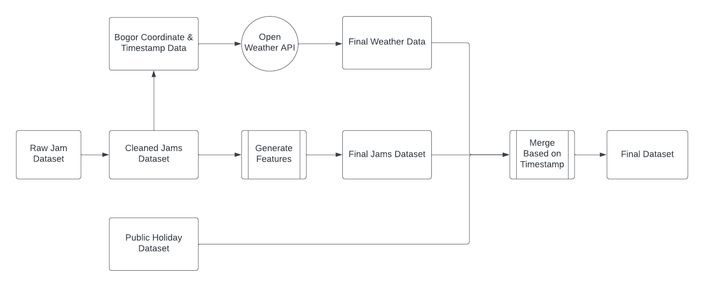

# Data Science Learning Studio 2023 : Data Analyst Project

## Proposed Solution

Using real time monitoring traffic data and weather data, Bogor City Government can manage traffic by deploying more Police Officer or Traffic Warden to relieve traffic jams

## Data Preprocessing Approach

## Goal

All the metrics selected including traffic condition, total jam recorded, level of jam and current weather condition have 1 goals

“To help governance take action as quick as possible to deploy resources (traffic warden, police officer, etc.s) on highly traffic street moreover if governance know where the traffic happened, then policy can be made to tackle traffic, such as : Odd-Even Rule or Paid Road Implementation”

## Document Report

[PowerBI Dashboard](report/Dashboard%20Traffic%20Monitor%20Ihsan%20Nur%20Faqih.pbix)
